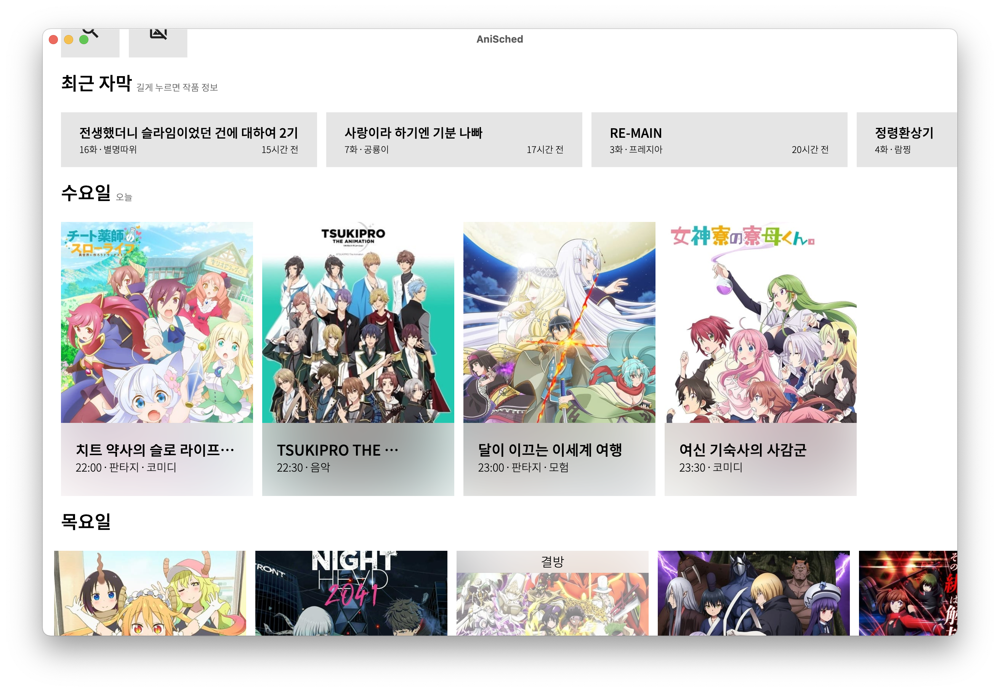
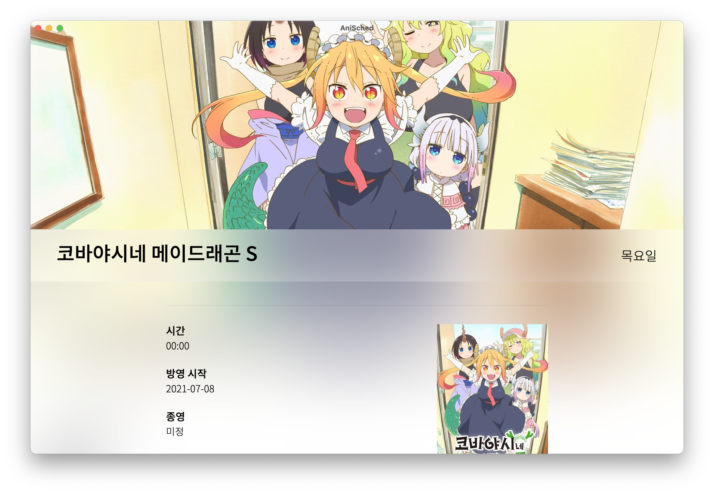
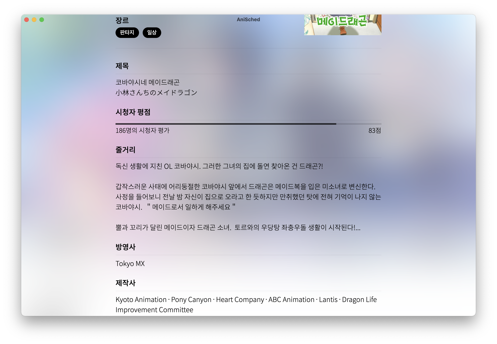
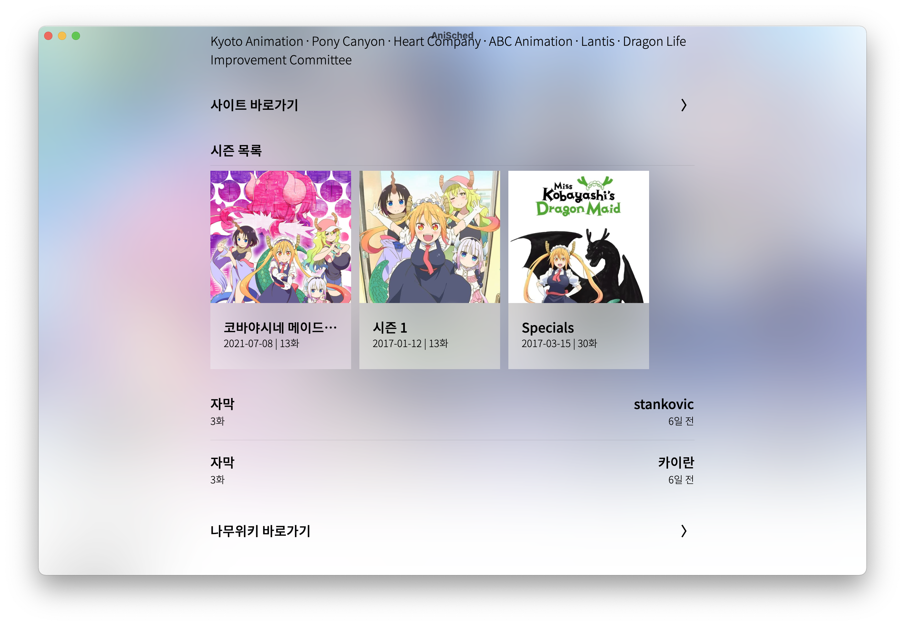
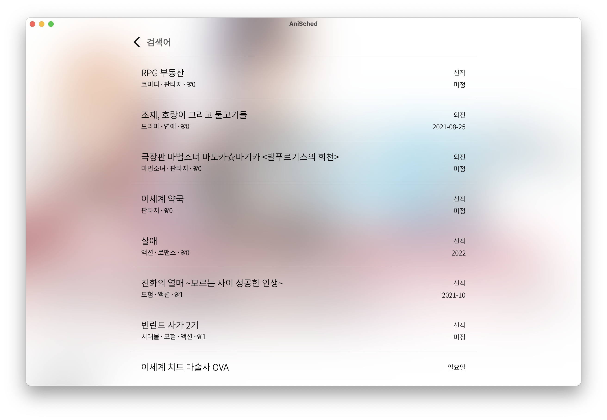
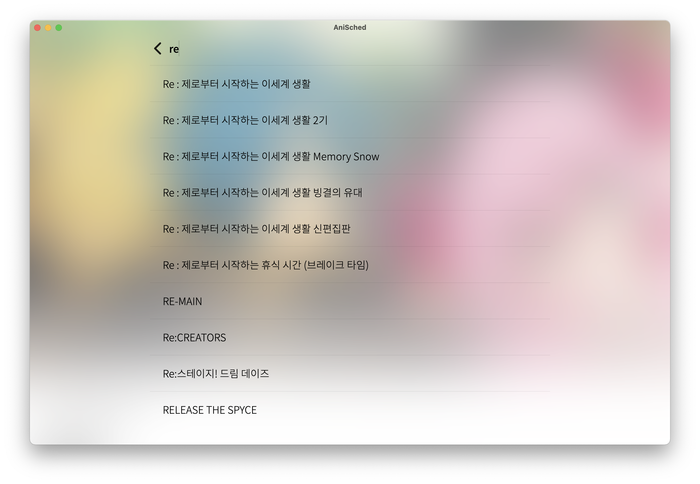

# AniSched-Desktop

<p align="center">
  
<br/><br/>
  <a href="https://raw.githubusercontent.com/qkdxorjs1002/AniSched-Desktop/main/img/b1.png">
    
  </a>
<br/>
  <a href="https://raw.githubusercontent.com/qkdxorjs1002/AniSched-Desktop/main/img/w2.png">
    
  </a>
  <a href="https://raw.githubusercontent.com/qkdxorjs1002/AniSched-Desktop/main/img/w3.png">
    
  </a>
<br/>
  <a href="https://raw.githubusercontent.com/qkdxorjs1002/AniSched-Desktop/main/img/w4.png">
    
  </a>
  <a href="https://raw.githubusercontent.com/qkdxorjs1002/AniSched-Desktop/main/img/w5.png">
    
  </a>
<br/>
  <a href="https://raw.githubusercontent.com/qkdxorjs1002/AniSched-Desktop/main/img/w6.png">
    
  </a>
  <a href="https://raw.githubusercontent.com/qkdxorjs1002/AniSched-Desktop/main/img/w7.png">
    
  </a>
<br/>

### 애니메이션 편성표 앱 (애니시아 API, TMDb)
<br/>
  
[](https://github.com/qkdxorjs1002/AniSched-Desktop/actions/workflows/deploy.yml)
[](https://github.com/qkdxorjs1002/AniSched-Desktop/releases)
[](https://opensource.org/licenses/Apache-2.0)
<br/><br/>

## 다운로드 
### 알림
- M1 맥의 경우 로제타를 통해 실행해야 합니다. (아직 ARM Binary 포함 X)
- 맥의 경우 우클릭 열기를 통해 신뢰 되지 않는 패키지 실행을 할 수 있습니다.
  
### Homebrew (macOS 10.11 이상)
```
$ brew tap qkdxorjs1002/tap
$ brew install anisched
```
  
### MS Store (Windows 10 이상)
[](https://www.microsoft.com/store/apps/9PB5WSXN3TMN) 

### 직접 다운로드 (macOS 10.11 이상, Windows 7 이상 지원)
[](https://github.com/qkdxorjs1002/AniSched-Desktop/releases) 
<br/><br/>

## 기능
무슨 애니메이션이 방영 예정인지 확인하세요.

애니시아와 TMDb 기반의 애니메이션 편성표입니다.

AniSched는 아래와 같은 기능을 제공합니다.
 - Light/Dark 모드 지원
 - 요일별 / 신작 / 외전 편성표
 - 제목, 방영 시간, 방영일, 종영일, 장르, 사이트 정보
 - 애니시아 주요 기능, 주간 순위
 - 포스터, 대표 이미지 등
 - 줄거리 및 시청자 평점, 시즌, 방송사 및 제작사 정보
 - 자막 정보, 최근 자막 목록
 - 위키 바로가기
 - 전체 검색 기능
 - 즐겨찾기 기능
 - 그 외 [추가 예정](https://github.com/qkdxorjs1002/AniSched-Desktop/projects/1)
<br/><br/>

## Q&A
### Q. 작품에 대한 상세 정보가 안나옵니다.
A. TMDb에 정보가 없거나 쿼리 결과가 없는 경우입니다. [TMDb](https://www.themoviedb.org/)에서 작품을 검색한 후 편집 페이지에서 다른 제목으로 앱의 편성표 제목에 나타난 이름을 추가해주세요.
<br/><br/>

## 사용된 API
 - [애니시아](https://anissia.net/) API
 - [TMDb](https://www.themoviedb.org/) API
 
